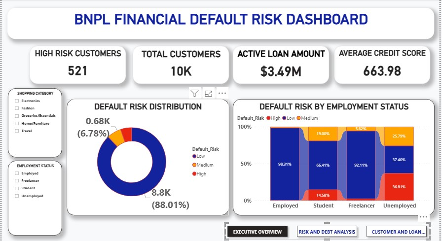
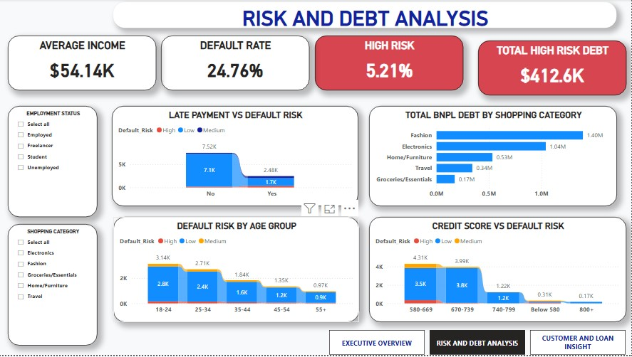
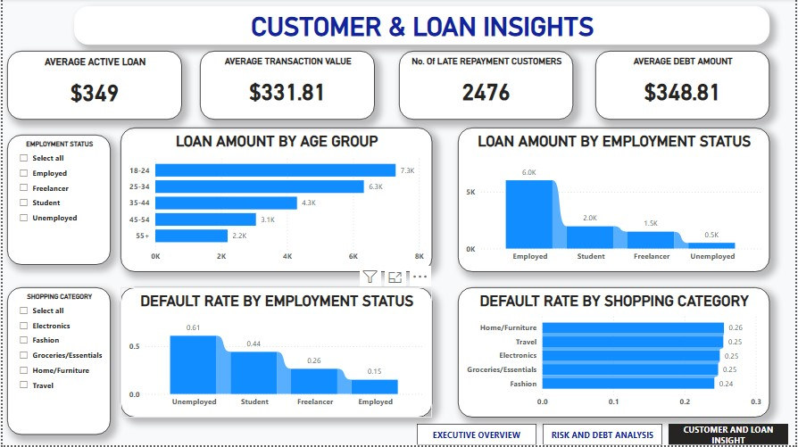

# 💳 BNPL Financial Default Risk Analysis

**Prepared by:** Ubong Solomon

---

## 1. Introduction

Buy Now, Pay Later (BNPL) lending allows customers to spread purchases into instalments, but it also exposes lenders to default risk that must be actively monitored and managed. This project analyzes a BNPL customer and loan dataset through an interactive Power BI dashboard, converting raw loan, repayment, and demographic data into insights that support management decisions on credit risk, collections strategy, and portfolio exposure.

The goal of this report is to summarize the dashboard's findings in a structured format for management review, and to translate the numbers into clear, actionable recommendations.

---

## 2. Data Description

The dataset underlying this dashboard covers BNPL customer, loan, and repayment records. Each record includes:

| Field | Description |
|---|---|
| Customer ID | Unique identifier per customer |
| Age Group | 18–24, 25–34, 35–44, 45–54, 55+ |
| Employment Status | Employed, Freelancer, Student, Unemployed |
| Shopping Category | Electronics, Fashion, Groceries/Essentials, Home/Furniture, Travel |
| Credit Score | Customer credit score, banded (Below 580, 580–669, 670–739, 740–799, 800+) |
| Income | Customer income |
| Loan Amount | Value of the BNPL loan issued |
| Transaction Value | Value of the underlying purchase transaction |
| Late Payment | Whether the customer has a late payment on record (Yes/No) |
| Default Risk | Risk classification: Low, Medium, or High |
| Debt Amount | Outstanding debt balance per customer |

**Scope:** 10,000 customers (10K), $3.49M in active loan amount, filterable by Employment Status, Shopping Category, and Age Group.

---

## 3. Methodology

The analysis followed these steps:

1. **Data consolidation** – Customer, loan, repayment, and risk-classification records were combined into a single structured table.
2. **Data cleaning** – Records were checked for missing values, consistent employment/shopping category naming, and correct Low/Medium/High risk classification.
3. **Aggregation** – Loan amount, debt, default rate, and risk level were aggregated by age group, employment status, shopping category, and credit score band.
4. **Visualization** – Aggregated measures were built into an interactive Power BI dashboard across three pages (Executive Overview, Risk and Debt Analysis, Customer and Loan Insights) using KPI cards, a donut chart, stacked/ribbon charts, and bar charts, with slicers for Shopping Category, Employment Status, and Age Group.
5. **Interpretation** – Patterns in the visualized data were reviewed to identify where default risk concentrates and to surface priority areas for management attention.

**Tool used:** Power BI Desktop

---

## 4. Analysis and Findings 

### 4.1 Overall Performance

| Metric | Value |
|---|---|
| Total Customers | **10,000** |
| High Risk Customers | **521** |
| High Risk (%) | **5.21%** |
| Default Rate | **24.76%** |
| Active Loan Amount | **$3.49M** |
| Total High Risk Debt | **$412.6K** |
| Average Credit Score | **663.98** |
| Average Income | **$54.14K** |
| Average Active Loan | **$349** |
| Average Debt Amount | **$348.81** |
| Average Transaction Value | **$331.81** |
| No. of Late Repayment Customers | **2,476** |

**Note:** No. of Late Repayment Customers (2,476) and the Default Rate (24.76%) are consistent with one another (2,476 / 10,000 ≈ 24.76%), and the Active Loan Amount ($3.49M) reconciles closely with the sum of BNPL debt across shopping categories in Section 4.4 ($3.48M) — a good sign of internal data consistency.

### 4.2 Default Risk Distribution
- Low Risk: **8,800 customers (88.0%)**
- Medium Risk: **680 customers (6.8%)**
- High Risk: **521 customers (5.2%)**

While High Risk customers are a small share of the base, they carry a disproportionate debt load — $412.6K in high-risk debt across 521 customers is an average of **~$792 per high-risk customer**, more than double the overall average debt amount of $348.81.

### 4.3 Default Risk by Employment Status

| Employment Status | Low Risk | Medium Risk | High Risk |
|---|---|---|---|
| Employed | 98.31% | ~1.69% combined (Medium/High) | — |
| Freelancer | 92.11% | 5.62% | ~2.27% |
| Student | 66.41% | 19.00% | 14.58% |
| Unemployed | 37.40% | 25.79% | 36.81% |

Risk rises sharply moving from Employed to Unemployed. Unemployed customers are nearly as likely to be High Risk (36.81%) as Low Risk (37.40%) — the weakest risk profile of any segment.

### 4.4 Total BNPL Debt by Shopping Category 
- Fashion: **$1.40M**
- Electronics: **$1.04M**
- Home/Furniture: **$0.53M**
- Travel: **$0.34M**
- Groceries/Essentials: **$0.17M**

Fashion and Electronics together account for roughly **70% of total BNPL debt outstanding**.

### 4.5 Late Payment vs. Default Risk
- No late payment on record: **~7,520 customers**, the large majority classified Low Risk
- Late payment on record: **~2,480 customers**, with a markedly higher share falling into Medium/High Risk than the "No" group

This closely mirrors the 2,476 Late Repayment Customers figure in Section 4.1, reinforcing that late payment history is a strong, consistent predictor of elevated default risk in this population.

### 4.6 Default Risk by Age Group
- 18–24: **3,140 total** (2,800 Low Risk)
- 25–34: **2,710 total** (2,400 Low Risk)
- 35–44: **1,840 total** (1,600 Low Risk)
- 45–54: **1,350 total** (1,200 Low Risk)
- 55+: **970 total** (900 Low Risk)

BNPL usage is heavily concentrated among younger customers (18–34), who together account for well over half of all records.

### 4.7 Credit Score vs. Default Risk
- 580–669: **4,310 total** (3,500 Low Risk)
- 670–739: **3,990 total** (3,800 Low Risk)
- 740–799: **1,220 total** (1,200 Low Risk)
- Below 580: **310 total**
- 800+: **170 total**

**Note:** The credit score bands are currently ordered 580–669, 670–739, 740–799, Below 580, 800+ on the dashboard axis (a text-sort artifact) rather than in ascending numeric order. Read carefully: the large majority of customers cluster in the 580–739 range, with very few customers at the extremes (Below 580 or 800+).

### 4.8 Loan Amount by Age Group 
- 18–24: **$7.3K**
- 25–34: **$6.3K**
- 35–44: **$4.3K**
- 45–54: **$3.1K**
- 55+: **$2.2K**

This mirrors the age-group usage pattern in Section 4.6 — younger customers drive both higher usage volume and higher total loan amount.

### 4.9 Loan Amount by Employment Status
- Employed: **$6.0K**
- Student: **$2.0K**
- Freelancer: **$1.5K**
- Unemployed: **$0.5K**

### 4.10 Default Rate by Employment Status
- Unemployed: **61%**
- Student: **44%**
- Freelancer: **26%**
- Employed: **15%**

### 4.11 Default Rate by Shopping Category
- Home/Furniture: **26%**
- Travel: **25%**
- Electronics: **25%**
- Groceries/Essentials: **24%**
- Fashion: **23%**

Unlike employment status, default rate is relatively flat across shopping categories (23%–26%) — category alone is a weak risk differentiator compared to employment status or age.

---

## 5. Key Insight

- **High Risk customers are few but costly.** Just 5.2% of customers (521) hold $412.6K in debt — an average of ~$792 per high-risk customer, more than double the portfolio-wide average.
- **Employment status is the strongest risk differentiator.** Default rate rises from 15% (Employed) to 61% (Unemployed), and Unemployed customers are nearly as likely to be High Risk as Low Risk.
- **Late payment history is a strong, consistent predictor of risk**, and the number of late-repayment customers (2,476) tracks almost exactly with the overall default rate (24.76%).
- **Fashion and Electronics drive the majority of debt exposure** (~70% combined), making them the categories most relevant to any exposure or collections review.
- **Younger customers (18–34) dominate BNPL usage**, both in customer count and total loan amount, meaning risk and collections strategy should weight this segment heavily.
- **Shopping category is a weak risk signal on its own** (23%–26% default rate across all categories), while employment status and payment history are far more predictive.

---

## 6. Recommendation

1. **Build a targeted collections and support strategy for High Risk customers**, given their outsized average debt (~$792 vs. $349 portfolio average) relative to their small share of the base.
2. **Tighten underwriting or apply risk-adjusted terms for Unemployed and Student applicants**, whose default rates (61% and 44%) are dramatically higher than Employed customers (15%).
3. **Use late payment history as an early-warning signal**, given how closely it tracks with overall default rate — consider automated flags or outreach as soon as a first late payment occurs.
4. **Review credit exposure concentration in Fashion and Electronics**, which together represent ~70% of total BNPL debt, to ensure risk isn't overly concentrated in these categories.
5. **Fix the credit score band ordering** on the Risk and Debt Analysis page (Below 580 currently displays out of sequence) to avoid misreading the credit-score-to-risk relationship in future reviews.
6. **Tailor product and repayment terms for the 18–34 age segment**, which drives the largest share of both usage and total loan value.

---

## 7. Conclusion

Across 10,000 BNPL customers and $3.49M in active loans, the portfolio carries an overall default rate of 24.76%, with 521 customers (5.2%) classified High Risk and holding a disproportionate $412.6K in debt. Employment status is the clearest driver of risk — default rates range from 15% for Employed customers to 61% for Unemployed customers — while shopping category shows only a weak relationship to default risk. Late payment history closely tracks the overall default rate, making it a reliable early-warning signal, and younger customers (18–34) account for the largest share of both usage and loan value. Acting on the recommendations in this report — sharper underwriting by employment status, early intervention on late payments, and closer monitoring of Fashion/Electronics exposure — can help management reduce default losses while continuing to serve the growing BNPL customer base responsibly.

---

**Prepared by:** Ubong Solomon
